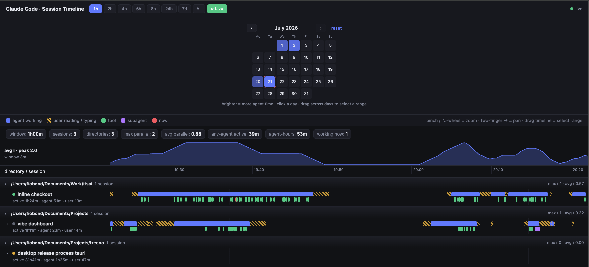

# Claude Code — Session Timeline

A live, browser-based Gantt of your **Claude Code** sessions, grouped by working directory
and read straight from the local transcripts in `~/.claude/`. No hooks, no config changes,
zero dependencies.

It shows, on one shared time axis, when each session's **agent was working**, when **you were
reading / typing**, every **tool call** and **subagent (Task)** run, plus live status, a
concurrency chart, a per-day activity heatmap, and drag-selectable stats.



## Features

- **Live Gantt of every session** — all your Claude Code sessions on one shared time axis,
  grouped by working directory, read straight from the `~/.claude/` transcripts. No hooks,
  no config changes, zero dependencies.
- **Four span lanes per session** — *agent working*, *user reading / typing* (estimated),
  every *tool* call, and every *subagent (Task)* run, all on the same axis.
- **Live updates over SSE** — the server tails `~/.claude/{projects,sessions,jobs}` and pushes
  a change event, so the board redraws as sessions run; each row shows live status
  (working / awaiting input / idle).
- **Concurrency at a glance** — an avg-parallel chart above the timeline plus a stats bar
  (max / avg parallel, any-agent-active wall-clock, agent-hours, working-now) that recomputes
  for the visible window or any drag-selected range.
- **Day heatmap** — a month calendar with one square per day (brighter = more agent-active
  time); hover for a day's stats, click or drag to open a day or a range.
- **Navigate freely** — time-window presets + Live mode, pinch / ⌥-wheel zoom, two-finger pan,
  drag-to-select a range, and a hover crosshair with instant / avg parallel counts.
- **Subagents & per-session totals** — expand any session with `Task` runs to see each
  subagent as its own row; a line under each session reads `active · agent · user` time.
- **Estimated user time** — reading / typing spans modelled from prompt length and agent
  output (Claude Code logs no keyboard signal), then de-conflicted so sessions running in
  parallel never claim the same person at the same moment.
- **Autostart on macOS** — an optional LaunchAgent runs the server at login and restarts it on
  crash.

### What it can't show

Pure passive viewing / scrolling and switching chats in FleetView *without acting* leave no
trace: Claude Code records no TUI focus/navigation events anywhere (confirmed — even its
internal telemetry has none), so no tool can reconstruct them. Idle time between turns is left
blank rather than guessed at.

## Run

```bash
cd ~/Documents/Projects/claude-session-timeline
npm start                 # or: node server.mjs
# open the URL it prints (http://localhost:4177 when free)
```

By default the server uses port **4177**, or the next free port the OS hands out if 4177 is
already taken (running a second instance never collides) — the actual URL is printed on start.
Pin an exact port with `PORT=5000 npm start`; an explicit port is treated as a hard
requirement and the server exits if it's busy.

### Autostart (macOS)

Run the server at login and keep it alive (restart on crash) via a LaunchAgent:

```bash
./scripts/install-launchagent.sh            # installs & loads com.claude-session-timeline
PORT=5000 ./scripts/install-launchagent.sh  # custom port
./scripts/uninstall-launchagent.sh          # stop & remove
```

The agent bakes the absolute path of your current `node` into the plist — re-run the
installer after switching Node versions (e.g. via nvm). Output goes to `server.log`.

## Controls

- **Time window:** `1h / 2h / 4h / 6h / 8h / 24h / 7d / All` presets, plus **⟳ Live** (the
  right edge follows *now*; any zoom/pan turns it off).
- **Zoom:** trackpad **pinch**, or **⌥ (Alt) + wheel** for a mouse — zooms around the cursor.
- **Pan:** **two-finger horizontal** scroll. (Plain vertical scroll moves the list.)
- **Select a range:** **drag** across the timeline — the stats bar recomputes for just that
  range (highlighted band). **Click anywhere** clears the selection.
- **Time-axis cursor:** hover anywhere over the timeline for a crosshair + tooltip with the
  time, **instant** parallel count and **avg** parallel at that point (session name too when
  hovering a row).
- **Day heatmap** (always visible under the header): one square per day of the month,
  brighter = more agent-active time. **Hover** a day for its stats (sessions, dirs,
  agent-hours, user time, prompts); **click** to open that day; **drag across days** to open
  a range. Page months with `‹ ›` (no paging into the future); *reset* returns to 24h.
- **Collapse a directory:** click a group header to fold/unfold its sessions.
- **Subagents:** a session with `Task` runs shows a `▸` toggle; expand it to see each
  subagent as its own row (labeled with its `agentType` and description).
- **Per-session totals:** a line under each session name reads
  `active <span> · agent <time> · user <time>`.

## Stats bar & concurrency chart

The stats bar (recomputed for the visible window or the drag-selected range) shows: session
count, directories, **max parallel** and **avg parallel**, **any-agent active** (wall-clock
time when ≥1 agent worked — the union), **agent-hours** (that time summed across sessions),
and how many are working right now. Above the timeline, the **avg-parallel chart** plots
concurrency over time as a sliding-window average (window scales with zoom).

## How activity is computed

Spans come from the transcript's event timestamps, with an **idle threshold** (`IDLE_MS`,
5 min in `lib/parse.mjs`):

- **agent working** — from a prompt through the agent's messages/tool calls, split wherever
  there is a gap longer than the threshold.
- **tool / subagent** — exact, from each `tool_use` to its `tool_result`. Tools that block on
  a human (currently `AskUserQuestion`) are capped at **1 min** so waiting for the answer
  isn't drawn as tool work.
- **user reading / typing** — *estimated*, because Claude Code logs no keyboard signal (see
  below).

### Estimating user time

The transcript records when each prompt is submitted and every agent event, but nothing about
what the human did in between — no keystrokes, no focus, no "typing" flag. `lib/user-activity.mjs`
models the gap between the agent finishing and the next prompt as **reading → idle → typing**
(a person does one thing at a time, so the two spans never overlap):

- **typing** — a prompt is sent the instant enter is pressed, so submission is the *end* of
  typing. We walk back from it by an estimate from the prompt's length (~40 wpm). Typing is
  anchored to the prompt and takes precedence over reading.
- **reading** — right after the agent stops, sized by how much text the agent produced
  (~200 wpm) and **capped at 2 min**, so a long pause isn't shown as active reading.
- **idle** — whatever is left in the middle stays blank: "thinking at the keyboard" and "away
  from the desk" are indistinguishable in the logs, so no activity is invented there.

A person also attends to **one session at a time**, yet each transcript is modelled on its
own — so the estimates from sessions running in parallel would otherwise overlap in
wall-clock time, which is impossible. A final pass (`resolveUserAttention`) lays every user
span on one shared "attention" timeline and trims the collisions: typing (anchored to a real
prompt) outranks estimated reading, and an earlier span keeps its window while a later one is
pushed into the free time — a reading span can even be split when a quick prompt to another
session lands in its middle. Agent/tool spans are left alone: agents genuinely do run at once.

The speed and cap constants live together at the top of `lib/user-activity.mjs` — tune them in
one place. Remember these spans are **estimates, not measurements**.

Concurrency metrics use each session's merged agent-working intervals, so "parallel" means
*actually running at the same time*, not merely open.

## Project structure

```
claude-session-timeline/
├── server.mjs              # zero-dep HTTP server: static + /api/data + /api/stream (SSE); fs.watch
├── lib/
│   ├── parse.mjs           # one transcript .jsonl → span lanes (agent / user / tool / subagent)
│   ├── user-activity.mjs   # estimates user reading/typing time (no keyboard signal in the logs)
│   └── scan.mjs            # scan sessions + subagents, overlay live status, group by cwd (mtime-cached)
├── public/
│   ├── index.html          # markup only
│   ├── styles.css
│   └── js/
│       ├── format.js       # tiny pure helpers (dates, durations, escaping)
│       ├── state.js        # shared app state + presets
│       ├── metrics.js      # concurrency profile / intervals math
│       ├── heatmap.js      # month calendar heatmap
│       ├── controls.js     # window presets + Live
│       ├── render.js       # ruler, rows, subagents, chart, stats
│       ├── interactions.js # zoom / pan / range-select / hover
│       ├── data.js         # fetch + enrich (per-session & per-day) + live SSE
│       └── main.js         # entry point
├── scripts/
│   ├── install-launchagent.sh
│   └── uninstall-launchagent.sh
└── docs/screenshots/
```

Data flow: `server.mjs` watches `~/.claude/{projects,sessions,jobs}` and pushes an SSE
`update` on any change; the browser refetches `/api/data`, derives per-session and per-day
aggregates, and redraws.

## Notes

- `fs.watch({recursive:true})` (macOS/Windows) drives live updates. On Linux swap in a
  polling watcher or `chokidar`.
- Timestamps are UTC in the logs and rendered in your local time.
- Append `?nostream` to the URL to load a static snapshot without the live SSE connection.
