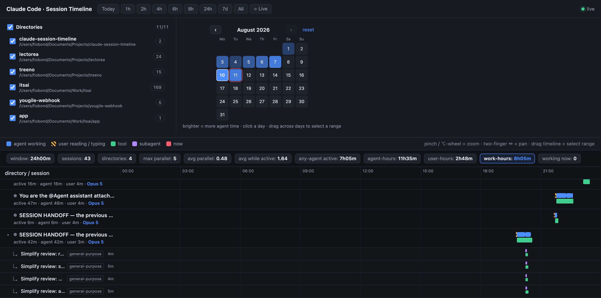

# Using the board

[← README](../README.md) · [Metrics](metrics.md) · [Install](install.md) · [How it works](architecture.md)

The page is one screen: a header with the controls, a concurrency chart, and the timeline
itself. Everything below the header reacts to the time window you pick and to the directory
filter — nothing needs to be reloaded.

## The four lanes

Each session is one row, and inside it four kinds of span share the same time axis:

| Lane | Colour | Meaning |
| --- | --- | --- |
| **agent working** | blue | the agent was producing output or running tools |
| **user reading / typing** | hatched yellow | *estimated* time you spent reading and writing |
| **tool** | green | a single tool call, exact start → end |
| **subagent** | purple | a `Task` run, exact start → end |
| **now** | red line | the current moment |

Blank space is idle: nothing happened, or nothing that the logs can prove (see
[Metrics → what it can't show](metrics.md#what-it-cant-show)).

## Time window

- **Presets:** `Today / 1h / 2h / 4h / 6h / 8h / 24h / 7d / All`. **Today** is the default and
  spans local midnight → now.
- **⟳ Live** keeps the right edge pinned to *now*; any zoom or pan switches it off.
- **Zoom:** trackpad **pinch**, or **⌥ (Alt) + wheel** with a mouse — zooms around the cursor.
- **Pan:** **two-finger horizontal** scroll. Plain vertical scroll moves the session list.
- **Select a range:** **drag** across the timeline. The stats bar recomputes for just that band;
  **click anywhere** to clear it.
- **Crosshair:** hover the timeline for a vertical guide plus the time, the **instant** parallel
  count and the **avg** parallel at that point (and the session name when you're over a row).

## Calendar heatmap

One square per day of the month, brighter = more agent-active time.

- **Hover** a day for its numbers: sessions, directories, agent-hours, work-hours, prompts.
- **Click** a day to open it; **drag across days** to open a range.
- Page months with `‹ ›` (no paging into the future); **reset** returns to Today.
- The heat obeys the directory filter, so it re-shades when you scope to a project.

## Directory filter

A checkbox per working directory beside the calendar — folder name, full path, and the number
of sessions in it.

- Untick a directory to drop it from **the stats, the chart, the heatmap and the timeline**.
- The header checkbox ticks / clears **all** at once (clear all → the board goes blank).
- All directories start ticked.

This is how you scope everything to one project or one employer.

**Folding is not filtering:** clicking a directory's group header collapses its rows, but that
is purely visual and changes no number. Use the filter to change what's counted.

## Session rows

Under each session name is a line reading `active  · agent <time> · user <time>`, followed
by the session's main **model** (the one that produced most of its turns). The dot on the left is
the live status: working, awaiting input, or idle.

A session that spawned subagents gets a `▸` toggle — expand it to see each `Task` run as its own
row, labelled with its agent type and description.

## Hover for the "how"

Every number carries its own explanation. Hover a stats-bar pill, a directory's `max ∥ · avg ∥`,
or the `active · agent · user` line under a session, and a popup spells out how that figure is
computed. [Metrics](metrics.md) has the same in long form.

## Live updates

The server watches `~/.claude/` and pushes an update over SSE whenever a transcript changes, so
the board redraws itself as sessions run. The dot in the top-right shows the connection state.
Append `?nostream` to the URL for a static snapshot with no live connection.
